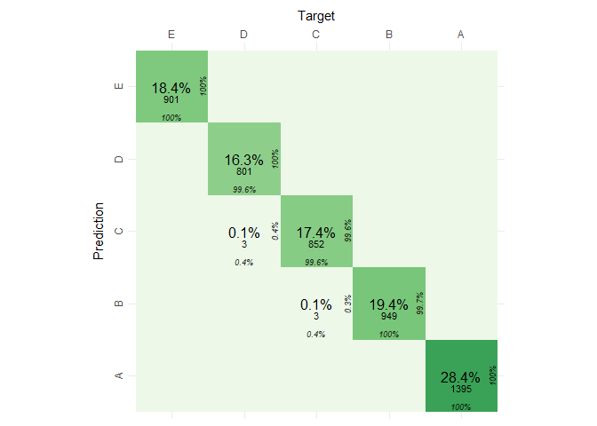

Background
----------

Using devices such as Jawbone Up, Nike FuelBand, and Fitbit it is now
possible to collect a large amount of data about personal activity
relatively inexpensively. These type of devices are part of the
quantified self movement – a group of enthusiasts who take measurements
about themselves regularly to improve their health, to find patterns in
their behavior, or because they are tech geeks. One thing that people
regularly do is quantify how much of a particular activity they do, but
they rarely quantify how well they do it. In this project, your goal
will be to use data from accelerometers on the belt, forearm, arm, and
dumbell of 6 participants. They were asked to perform barbell lifts
correctly and incorrectly in 5 different ways. More information is
available from the website here:
<a href="http://groupware.les.inf.puc-rio.br/har" class="uri">http://groupware.les.inf.puc-rio.br/har</a>
(see the section on the Weight Lifting Exercise Dataset).

Loading data
------------

The first step to find a accurate prediction model is to load the data
and libraries into the workspace:

``` r
# Loading libraries
library(dplyr)
library(data.table)
library(caret)
library(gbm)
library(randomForest)
#
# Checking if the data was previously downloaded
source("getData.R", local = knitr::knit_global())
```

    ## [1] "The testing dataset was previously downloaded"
    ## [1] "The training dataset was previously downloaded"

``` r
#
# Loading the data into the workspace
training <- fread("./datasets/pml-training.csv")
testing  <- fread("./datasets/pml-testing.csv")
#
```

Cleaning data
-------------

To clean the data, it is necessary to remove the follow features:

1.  The fist 7 features, due that this information is unnecessary  
2.  Features that contain a lot of NaN samples  
3.  Near zero variance features

``` r
# Removing the first 7 columns
NUM_OF_COL <- dim(training)[2]
training   <- training[, 8:NUM_OF_COL]
#
# Counting and removing the missing values
NUM_OF_SAMPLES <- dim(training)[1]
#
cleaning <- sapply(training, function(x){
                sum(is.na(x)) < NUM_OF_SAMPLES*0.4
                })
training <- training[, ..cleaning]
#
# Identification of near zero variance predictors
nzvp     <- nearZeroVar(training)
training <- select(training, -nzvp)
#
training$classe = factor(training$classe)
```

Training the model
------------------

The training dataset is used to fit a random forest model. The options
on the **trainControl** function allows to perform a 5-fold cross
validation when applying the algorithm. Also, a 25% of the training
dataset is separated to compute a confusion matrix later.

``` r
# Trimming data to cross validation
inTrain  <- createDataPartition(training$classe, p = 0.75, list = F)
crossVal <- training[-inTrain,]
training <- training[ inTrain,]
#
if(!file.exists("./RF_model.rds")){
    set.seed(1234)
    control <- trainControl(method = "cv",
                    number = 5, 
                    verboseIter     = TRUE,
                    classProbs      = TRUE,
                    allowParallel   = TRUE,
                    savePredictions = T)
    mod2 <- train(classe ~ ., 
                  data      = training, 
                  method    = "rf", # "gbm"
                  trControl = control)
    
    saveRDS(mod2, "./RF_model.rds")
} else {
    mod2 <- readRDS("./RF_model.rds")
}
```

Evaluating the trained model
----------------------------

After adjusting the random forest model, it is tested against the
validation data. The extracted 25% of the training dataset is used now
to compute the confusion matrix.

``` r
library(broom)
library(tibble) 
library(cvms)
#
prediction <- predict(mod2, crossVal)
#
cfm <- tidy(table(tibble("target"=crossVal$classe,"prediction"=prediction)))
#
plot_confusion_matrix(cfm, 
                      target_col = "target", 
                      prediction_col = "prediction",
                      counts_col = "n",
                      palette = "Greens")
```



With the previous training, the model have 6 misclassification from 4904
samples. It means that the accuracy of the model is 0.9987765. How the
accuracy of the model is excellent, it is not necessary to train another
model.

Predicting new data
-------------------

Apply the machine learning algorithm to the 20 test cases available in
the test data and submit your predictions in appropriate format to the
Course Project Prediction Quiz for automated grading.

``` r
testing <- testing[, 8:NUM_OF_COL]
testing <- testing[, ..cleaning]
testing <- select(testing, -nzvp)
#testing <- testing[,-..highlyCorDescr]
#preproc <- preProcess(training, method=c("range"))
#testing <- predict(preproc, testing)
#
prediction1 <- predict(mod2, testing)
prediction1
```

    ##  [1] B A B A A E D B A A B C B A E E A B B B
    ## Levels: A B C D E
